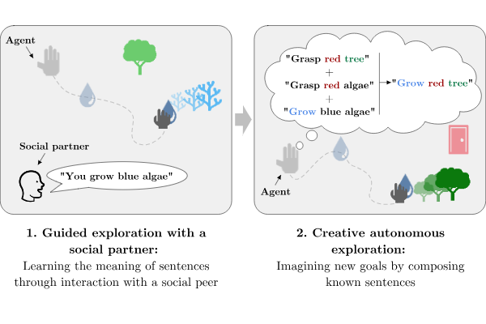

# IMAGINE: Language as a Cognitive Tool to Imagine Goals in Curiosity Driven Exploration

This repo contains the code base of the paper [Language as a Cognitive Tool to Imagine Goals inCuriosity-Driven Exploration](https://arxiv.org/pdf/2002.09253.pdf).

## Context 

Learning __open-ended repertoire__ of skills requires agents that autonomously explore their environments. To do so, they need to self-organize their exploration by generating and selecting their goals ([IMGEP](https://arxiv.org/abs/1708.02190)). In this framework, how can agents make creative discoveries?

In this paper, we propose to equip agents with language grounding capabilities in order to represent goals as language. We then leverage language compositionality and systematic generalizaiton as a means to perform __out-of-distribution goal generation__.




We follow a developmental approach inspired by the role of egocentric language in child development ([Piaget](https://books.google.fr/books/about/The_Language_and_Thought_of_the_Child.html?id=WYoEXQLGRLEC&redir_esc=y) and [Vygotsky](https://www.marxists.org/archive/vygotsky/works/1934/tool-symbol.htm)) and generative expressivity ([Chomsky](https://books.google.fr/books?hl=en&lr=&id=SNeHkMXHcd8C&oi=fnd&pg=PR5&dq=noam+chomsky+syntactic+structures&ots=AW4uSxTupP&sig=o76nScH_zdA62OOimmxpwvNe8hs#v=onepage&q=noam%20chomsky%20syntactic%20structures&f=false)).

## Requirements

The dependencies are listed in the requirements.txt file. Our conda environment can be cloned with:
```
conda env create -f environment.yml
```

## Notebook


We propose a [Google Colab Notebook](https://colab.research.google.com/drive/1G9LmvhbvR40XJ-cysgP6zynBnq_fHY63#scrollTo=HmGFArOeXvps) to walk you through the IMAGINE learning algorithm. 


## Demo

1. Run pre-trained weights

The demo script is /src/imagine/experiments/play.py. It can be used as such:

```python play.py```

## RL training


1. Running the algorithm

The main running script is /src/imagine/experiments/train.py. It can be used as such:

```
python train.py --num_cpu=6 --architecture=modular_attention --imagination_method=CGH --reward_function=learned_lstm  --goal_invention=from_epoch_10 --n_epochs=167
```

Note that the number of cpu is an important parameter. Changing it is **not** equivalent to reducing/increasing training time. One epoch is 600 episodes. Other parameters can be
 found in train.py. The config.py file contains all parameters and is overriden by parameters defined in train.py.
 
 Logs and results are saved in /src/data/expe/PlaygroundNavigation-v1/trial_id/. It contains policy and reward function checkpoints, raw logs (log.txt), a csv containing main metrics (progress.csv) and a json file with the parameters (params.json).
 
 2. Plotting results
 
 Results for one run can be plotted using the script /src/analyses/new_plot.py
 
 ## Links
 
- _Playground_ Environment code base: https://github.com/flowersteam/playground_env
- Website: https://sites.google.com/view/imagine-drl

## Citation

'''
@misc{colas2020language,
      title={Language as a Cognitive Tool to Imagine Goals in Curiosity-Driven Exploration}, 
      author={Cédric Colas and Tristan Karch and Nicolas Lair and Jean-Michel Dussoux and Clément Moulin-Frier and Peter Ford Dominey and Pierre-Yves Oudeyer},
      year={2020},
      eprint={2002.09253},
      archivePrefix={arXiv},
      primaryClass={cs.AI}
}

'''


